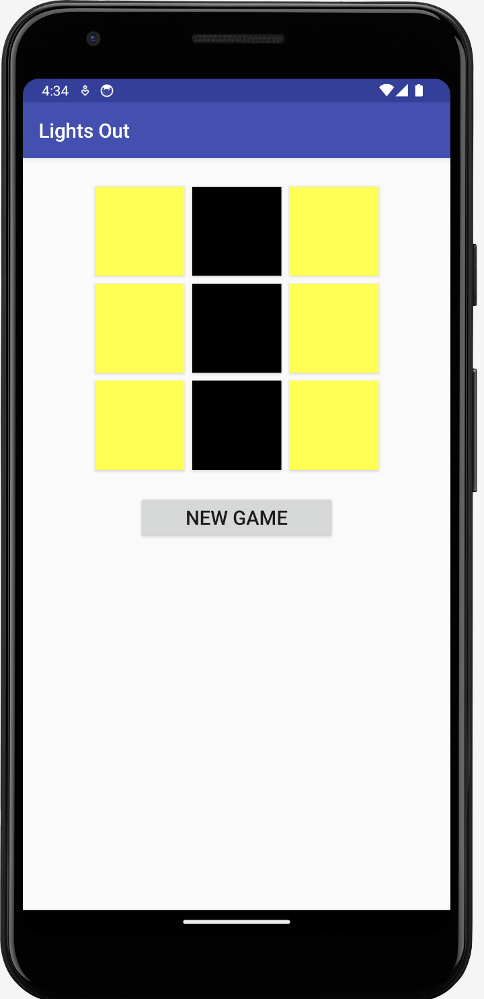

# LightsOutGame

**LightsOutGame** is a simple and addictive puzzle game for Android where the goal is to turn off all the lights in a 3x3 grid. Each tap toggles the light and its adjacent lights, creating a challenging and fun experience.

## How to Play
- Tap on any light to toggle it and its adjacent lights (up, down, left, and right).
- The objective is to turn off all the lights to win the game.
- If you're stuck, you can always start a new game by pressing the "New Game" button.

## Features
- **3x3 grid**: A small grid that offers quick and fun puzzles.
- **Simple and intuitive interface**: Easy to pick up and play.
- **New Game button**: Allows players to restart the game at any time.

## Screenshots
Here are some screenshots of the game in action:

| Game in Progress       | Game Over            |
|------------------------|----------------------|
|  |  |

## Installation

To run this project locally on your machine, follow these steps:

1. **Clone the repository**:
   ```bash
   git clone https://github.com/cmontilha/LightsOutGame.git

1. Open Android Studio.
2. Click on **File > Open**, navigate to the cloned directory, and select the `LightsOutGame` folder.

## Build and Run the app:

1. Make sure you have an Android device or emulator set up.
2. Click the **Run** button (the green play icon) in Android Studio to install and run the app on your device.

## Requirements:

- **Android Studio** version 4.1 or higher.
- **Android SDK** installed.
- A physical Android device or an emulator with **API Level 21** (Lollipop) or higher.

## License:

This project is licensed under the MIT License.
